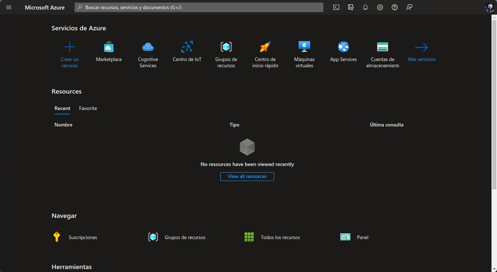
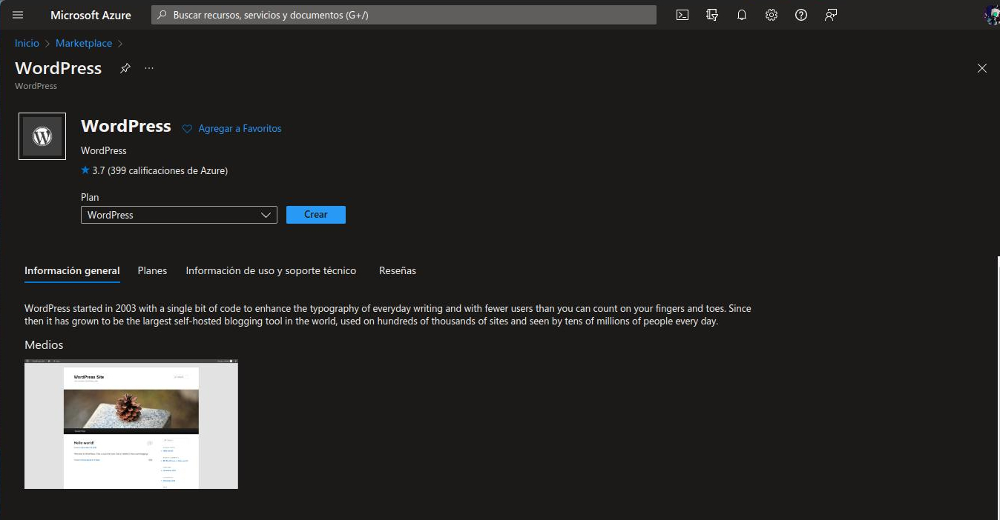
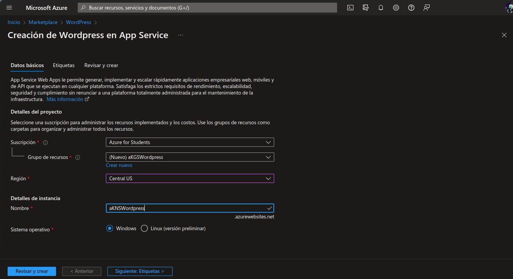
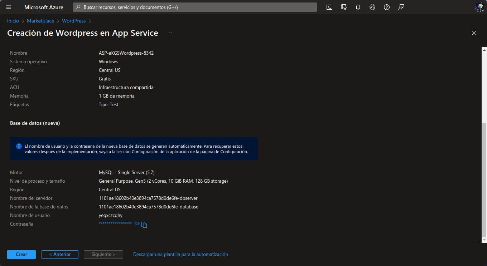
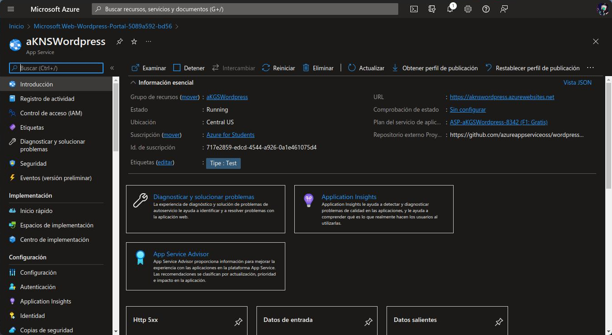
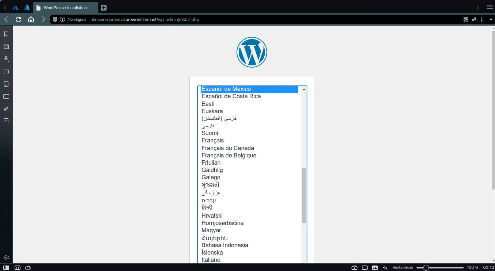
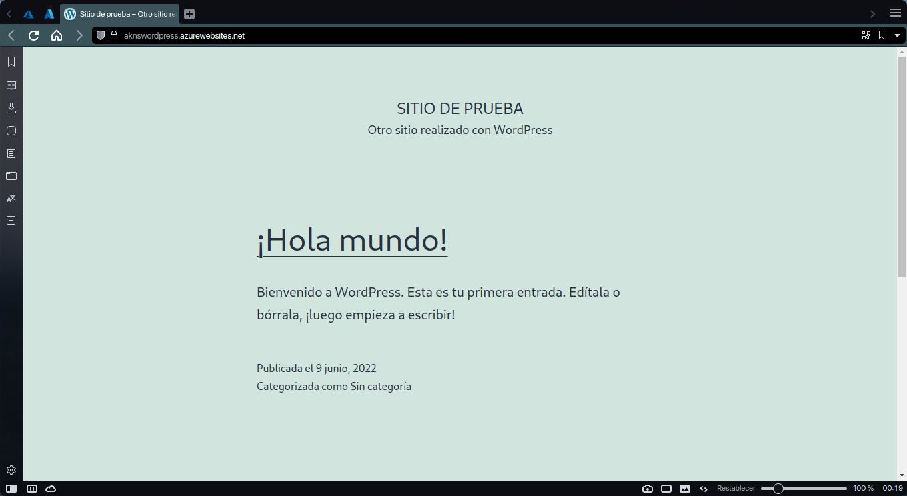

# Crear una aplicación web de Wardpress con Azure App Service

Antes de todo, es necesario tener una suscripción de Azure.

# Portal de Azure
Es necesario buscar WordPress en el [portal de Azure](https://portal.azure.com) como Inicio>Marketplace>WordPress.


Para poder crear una aplicación web de WordPress, es necesario llenar tres formularios:


## Datos básicos
Dentro de los datos basicos es necesario mencionar la suscripción de Azure a usar (en este caso una suscripción de estudiante), el grupo de recursos a usar (aKGSWordpress), el nombre de la aplicación web (aKNSWordpress) y el sistema operativo a usar.

## Etiquetas  
Dentro de este formulario se pueden mencionar las etiquetas que se desean para la aplicación web.

## Revisar y crear
En est seccion se muestran los datos que se han mencionado anteriormente, ademas de informacion adicional como el nombre del servidor o el usuario y contraseña que genera Azure.

Si todo esta bien, se puede crear la aplicación web con el boton de ```Crear```.


# Recursos
Una vez creados los recursos, podemos acceder a ellos desde el boton ```Ir al recurso``` que nos dirige al recurso de ```App Service```. Entre las opciones que nos permite usar Azure, URL nos permite acceder a la URL de la aplicación web.


## Aplicación web
La primera vez que accedemos a la aplicación web, nos aparecerá la confirmación (idioma, titulo del sitio, nombre del usuario, contraseña, etc). Y despues de unos momentos, nos aparecera la aplicación web al entrar a ```ElNombreDelSitio.azurewebsites.net```.


